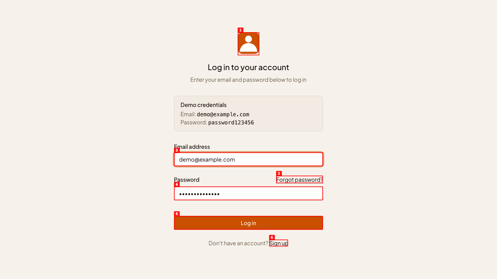
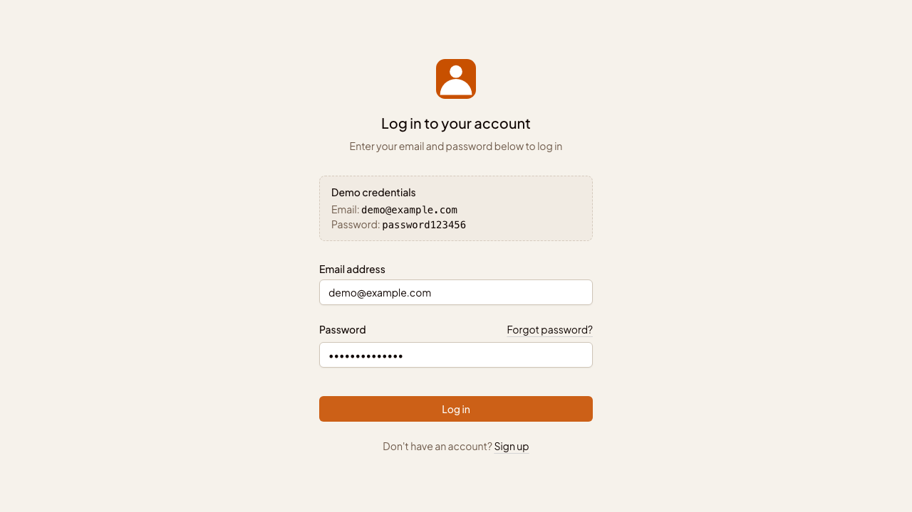
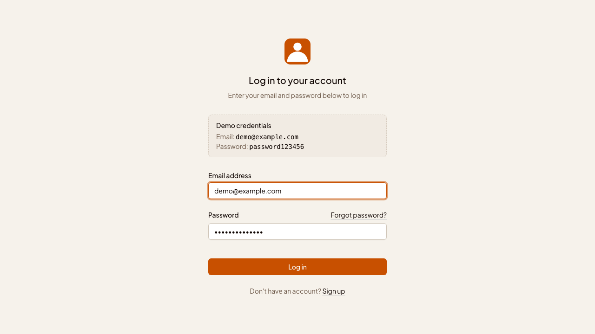
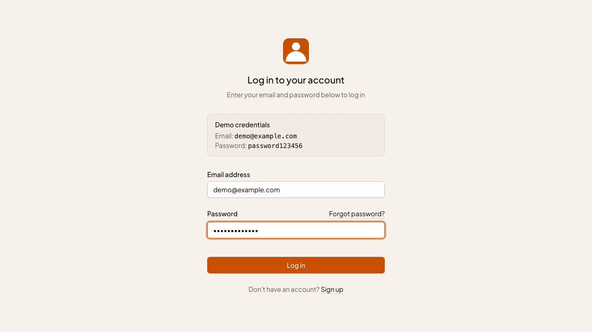
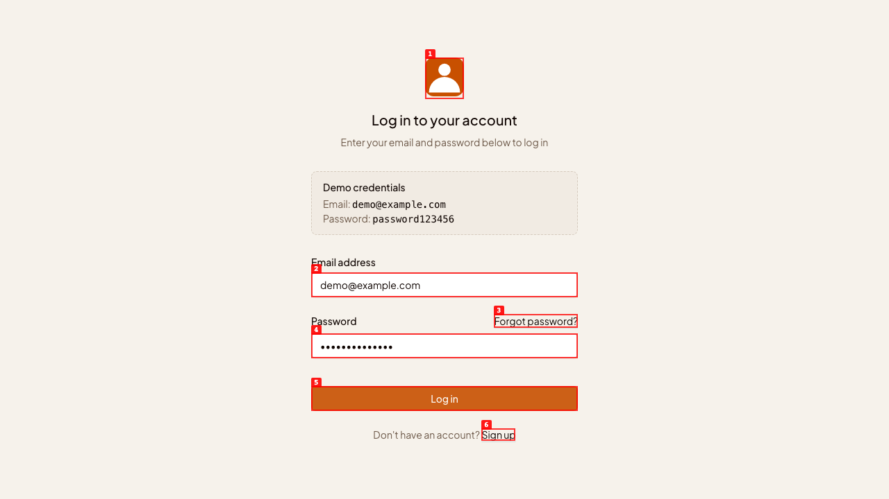
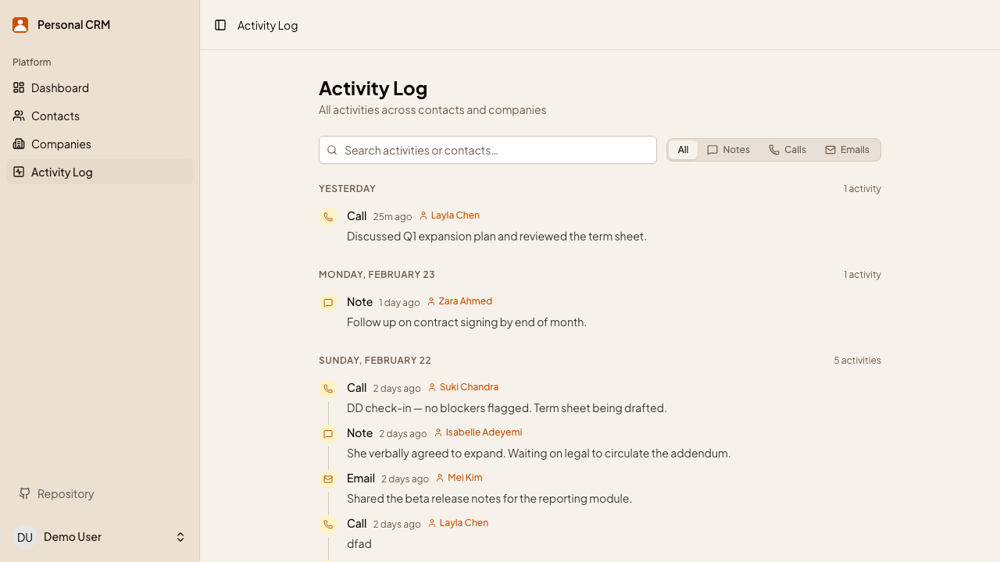
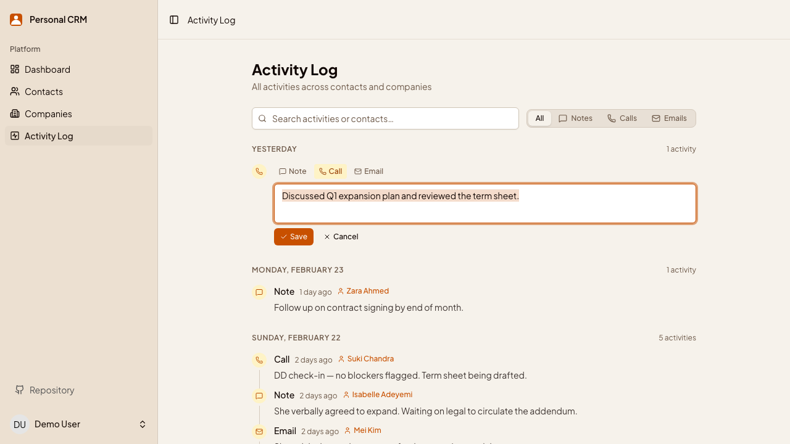
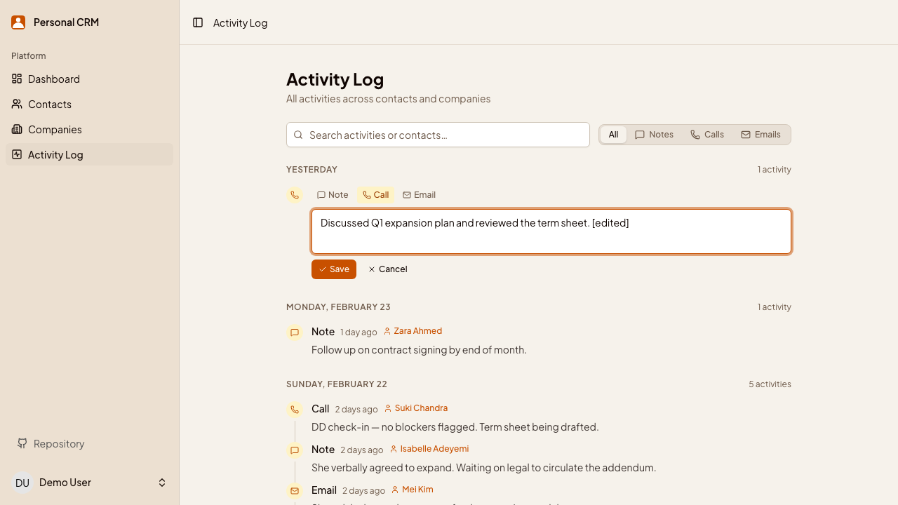
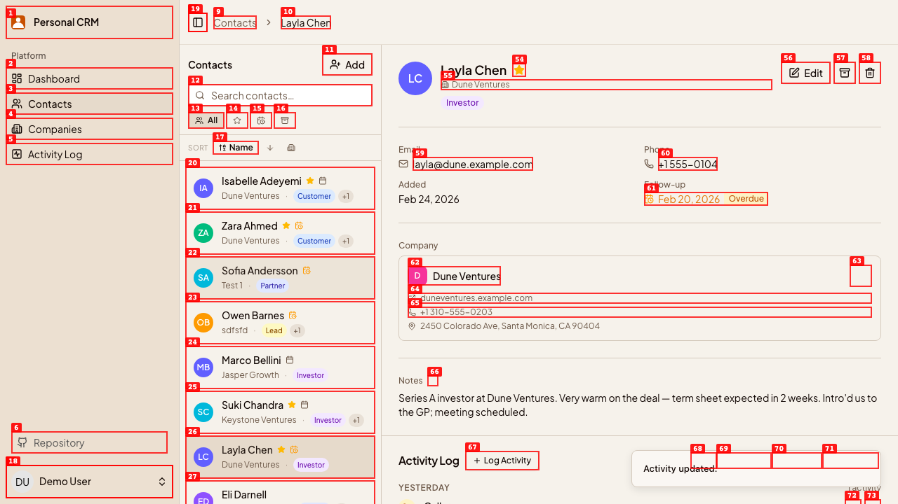
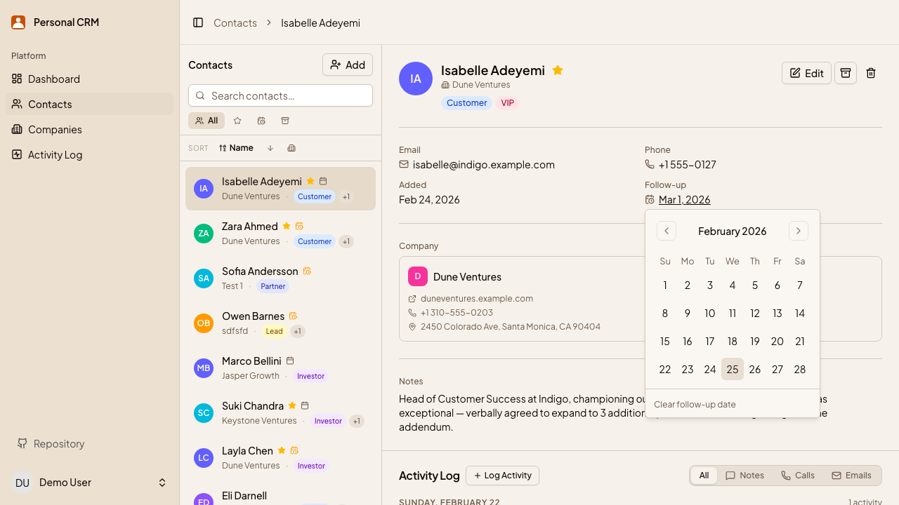

# Dogfood Report: Personal CRM

| Field | Value |
|-------|-------|
| **Date** | 2026-02-24 |
| **App URL** | http://localhost:3000 |
| **Session** | personal-crm |
| **Scope** | Full app — contacts, companies, activities, navigation, forms |

## Summary

| Severity | Count |
|----------|-------|
| Critical | 0 |
| High | 1 |
| Medium | 2 |
| Low | 1 |
| **Total** | **4** |

## Verification

All 4 issues verified fixed on 2026-02-25 (commit `06cb1e8`).

| Issue | Status | Evidence |
|-------|--------|----------|
| ISSUE-001 | ✅ Fixed | Demo credentials now log in and redirect to Dashboard |
| ISSUE-002 | ✅ Fixed | Toast "That email or password is incorrect" shown on failure |
| ISSUE-003 | ✅ Fixed | User stays on Activity Log after saving an edit |
| ISSUE-004 | ✅ Fixed | Calendar opens on March 2026 with Mar 1 pre-selected |

Screenshots: `verification/screenshots/` · Videos: `verification/videos/`

---

## Issues

### ISSUE-001: Demo credentials on sign-in page do not work

| Field | Value |
|-------|-------|
| **Severity** | high |
| **Category** | functional |
| **URL** | http://localhost:3000/sign_in |
| **Repro Video** | N/A |
| **Fixed** | ✅ 2026-02-25 (commit `06cb1e8`) |

**Description**

The sign-in page displays demo credentials (`demo@example.com` / `password123456`) in a clearly visible "Demo credentials" box. Submitting the form with these credentials silently fails — the page reloads without any error message, and the user remains on the sign-in page. The stored BCrypt digest for the demo user does not match `password123456`. Root cause: `seeds.rb` uses `find_or_create_by!` which only sets the password on initial creation; re-running seeds after the user already exists leaves the old (mismatched) hash in place.

**Repro Steps**

1. Navigate to http://localhost:3000/sign_in
   

2. Copy credentials from the "Demo credentials" box — `demo@example.com` / `password123456` — and fill the form, then click **Log in**
   

3. **Observe:** Page reloads and user is still on `/sign_in`. No error message is shown. The user cannot tell whether the credentials are wrong or something else failed.
   

---

### ISSUE-002: No error message shown when sign-in fails with wrong credentials

| Field | Value |
|-------|-------|
| **Severity** | medium |
| **Category** | ux |
| **URL** | http://localhost:3000/sign_in |
| **Repro Video** | N/A |
| **Fixed** | ✅ 2026-02-25 (commit `06cb1e8`) |

**Description**

When a user submits the sign-in form with invalid credentials, the page silently reloads with no feedback whatsoever — no error message, no toast, no inline validation. The email and password fields are cleared and the form looks exactly as it did before submission. A user has no way to know whether their credentials were rejected, the server errored, or anything else went wrong.

**Repro Steps**

1. Navigate to http://localhost:3000/sign_in (while signed out)
   

2. Enter any email and a wrong password (e.g. `demo@example.com` / `wrongpassword`), then click **Log in**
   

3. **Observe:** Page reloads. No error message, no toast, no inline validation. The form is blank and the user has no idea what happened.
   

---

### ISSUE-003: Editing an activity on the global Activity Log redirects to a contact page

| Field | Value |
|-------|-------|
| **Severity** | medium |
| **Category** | ux |
| **URL** | http://localhost:3000/activities |
| **Repro Video** | videos/issue-003-activity-redirect.webm |
| **Fixed** | ✅ 2026-02-25 (commit `06cb1e8`) |

**Description**

When a user edits an activity on the global Activity Log page (`/activities`) and clicks Save, they are redirected to the contact detail page for the activity's associated contact instead of staying on the Activity Log. Expected behavior: after saving an inline edit, the user should remain on the Activity Log page.

**Repro Steps**

1. Navigate to http://localhost:3000/activities
   

2. Click **Edit** on any activity entry
   

3. Modify the activity text and click **Save**
   

4. **Observe:** The user is redirected to `/contacts/{id}` — the detail page for the activity's associated contact — instead of remaining on the Activity Log.
   

---

### ISSUE-004: Follow-up date calendar opens on current month instead of the selected date's month

| Field | Value |
|-------|-------|
| **Severity** | low |
| **Category** | ux |
| **URL** | http://localhost:3000/contacts/{id} |
| **Repro Video** | N/A |
| **Fixed** | ✅ 2026-02-25 (commit `06cb1e8`) |

**Description**

When clicking the follow-up date on a contact whose follow-up date is in a future month, the calendar date picker opens on the current month rather than the month of the already-set follow-up date. The user has to manually navigate forward to find and confirm or adjust the date. Expected behavior: the calendar should open to the month containing the currently selected follow-up date.

**Repro Steps**

1. Open any contact with a follow-up date set to a future month (e.g. Isabelle Adeyemi — follow-up Mar 1, 2026)

2. Click the follow-up date button

3. **Observe:** The calendar opens on the current month (February 2026) instead of March 2026. The selected date (Mar 1) is not visible without navigating forward.
   

---

