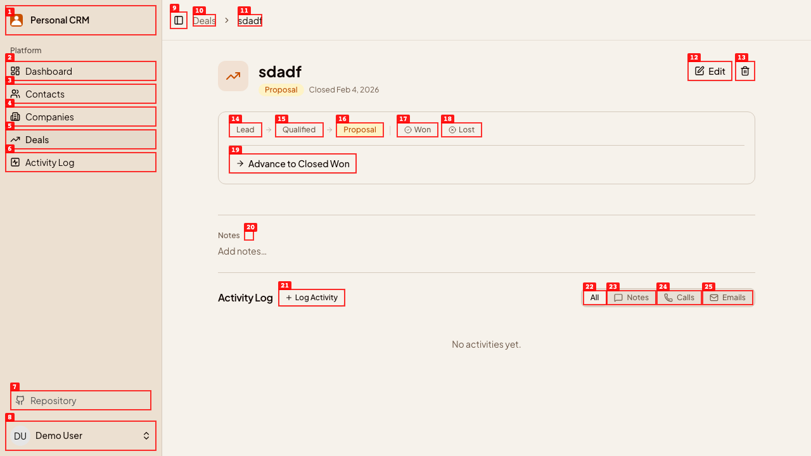

# Dogfood Report: Personal CRM — Deals Pipeline

| Field | Value |
|-------|-------|
| **Date** | 2026-02-25 |
| **App URL** | http://localhost:3000 |
| **Session** | deals-pipeline |
| **Scope** | Deals pipeline feature: kanban board, deal CRUD, deal show page, deal activities, dashboard widget |

## Summary

| Severity | Count |
|----------|-------|
| Critical | 0 |
| High | 0 |
| Medium | 0 |
| Low | 0 |
| **Total** | **0** |

## Issues

<!-- Copy this block for each issue found. Interactive issues need video + step-by-step screenshots. Static issues (typos, visual glitches) only need a single screenshot -- set Repro Video to N/A. -->

### ISSUE-001: "Closed" date shown on open-stage deals

| Field | Value |
|-------|-------|
| **Severity** | medium |
| **Category** | functional / content |
| **URL** | http://localhost:3000/deals/49 |
| **Repro Video** | N/A |

**Description**

The deal show page header shows "Closed Feb 4, 2026" even though the deal is in the "Proposal" stage (an open stage). The `closed_at` field is stored in the DB but is never automatically managed: moving a deal to a closed stage does not auto-set `closed_at`, and moving it back to an open stage does not clear it. As a result, any deal that has a stale or incorrectly-set `closed_at` will display a misleading "Closed [date]" label next to the stage badge while still appearing in the open pipeline.

Additionally, when a user advances/moves a deal to `closed_won` or `closed_lost` via the inline stage buttons, `closed_at` is never written — so the "Closed" date will never appear for legitimately closed deals either.

**Repro Steps**

1. Navigate to a deal that has `closed_at` set but is in an open stage (e.g., the "sdadf" deal at `/deals/49`).
   

2. **Observe:** The subtitle row shows "Proposal · Closed Feb 4, 2026" — the "Closed" date is shown even though the deal is still in the Proposal (open) stage.

---

